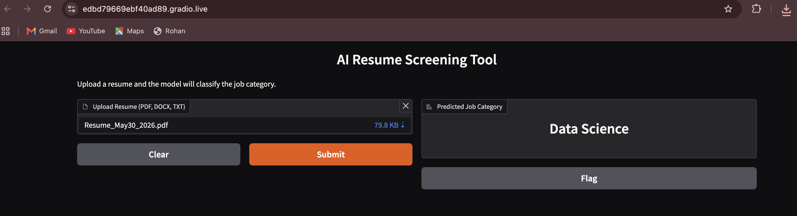

# Prototype-AI-Resume-Screening-Tool
Match Resumes to a Job Title
---
<table>
<tr>
<td width="75%">

# AI Resume Screening Tool

### Automated Resume Classification Using Natural Language Processing and Machine Learning

This project demonstrates the development of an end-to-end AI-powered resume screening system capable of analyzing resume content and automatically classifying candidates into professional job categories.

Designed as a proof-of-concept recruitment assistant, the application leverages Natural Language Processing (NLP), machine learning, and web deployment technologies to transform unstructured resume documents into actionable candidate classifications.

 

  

## Business Problem

Recruiters often spend significant time reviewing resumes before determining whether a candidate aligns with a target role.

The goal of this project was to develop a scalable machine learning pipeline capable of:

- Processing unstructured resume documents
- Extracting meaningful textual features
- Classifying resumes into professional categories
- Supporting faster candidate screening workflows
- Providing a user-friendly interface for recruiters and hiring teams

## Dataset

The model was trained using a labeled resume dataset containing approximately:

- 960+ Resumes
- 25–30 Professional Categories

Examples include:

- Data Science
- Business Analysis
- HR
- Sales
- Operations
- Testing
- Network Engineering
- Finance
- Mechanical Engineering
- Healthcare

Each record consisted of:

- Resume Text
- Job Category Label

## Technical Workflow

### Data Preparation

- Resume text cleaning
- Text normalization
- Train-Test Split
- Label Encoding
- Feature Engineering

### Natural Language Processing

- TF-IDF Vectorization
- Sparse Feature Generation
- Multi-Class Text Classification

### Model Development

The project initially utilized a traditional SVC model before being redesigned to use **LinearSVC**, a model better suited for high-dimensional NLP datasets.

Reasons for selecting LinearSVC:

- Faster training and inference
- Optimized for sparse TF-IDF vectors
- Better scalability
- Industry-standard baseline for text classification
- Strong performance on high-dimensional resume data

### Application Development

A complete user-facing application was developed using Gradio.

Features include:

- Resume Upload
- PDF Resume Support
- TXT Resume Support
- Automated Category Prediction
- Real-Time Classification Results

## Deployment

The application was deployed using Gradio and Google Colab, allowing users to interact with the model through a web interface without requiring local installation.

Benefits of the deployment approach:

- Fully cloud-hosted
- Rapid prototyping
- Public web access
- Cross-platform compatibility

## Key Learning Outcomes

- Natural Language Processing (NLP)
- TF-IDF Feature Engineering
- Multi-Class Classification
- Machine Learning Model Selection
- Model Evaluation and Debugging
- Web Application Deployment
- End-to-End AI Product Development

## ⚠️ Limitations
Like most machine learning systems, model performance is heavily influenced by the quality and depth of available data.

### Limited Resume Diversity

The training dataset contains approximately 960 resumes across 25–30 job categories. While sufficient for building a proof-of-concept system, a larger and more diverse dataset would improve the model's ability to generalize across industries, experience levels, and emerging job roles.

### Skill Depth and Context Recognition

The model primarily relies on textual patterns extracted through TF-IDF vectorization. While effective for category classification, it does not fully capture:

- Skill proficiency levels
- Project complexity
- Industry-specific experience
- Career progression
- Contextual relationships between technologies

Incorporating richer skill ontologies, embeddings, or modern transformer-based architectures could significantly improve job-matching accuracy.

### Limited Career Matching Capability

The current system predicts the most likely job category for a resume rather than evaluating candidate-job fit. Future versions could incorporate:

- Job description matching
- Skill gap analysis
- Resume scoring
- Candidate ranking
- Recommendation systems

### Deployment Constraints

The application is deployed using the free Gradio hosting environment for demonstration purposes. 
⚠️ <u><strong><em>Needs a refresh every 24 hours.</em></strong></u>

Current limitations include:

- Free-tier Gradio deployments may require periodic application refreshes (approximately every 24 hours) to remain accessible.
- Manual refresh requirements
- Temporary public URLs
- Resource limitations for larger workloads

A production deployment would benefit from dedicated cloud infrastructure, persistent hosting, and automated scaling capabilities.

## Tools & Technologies

Python • Gradio • Google Colab • Excel • NLP • TF-IDF • LinearSVC • Machine Learning

</td>

<td width="25%" align="center">

  

  

  

  

</td>
</tr>
</table>
